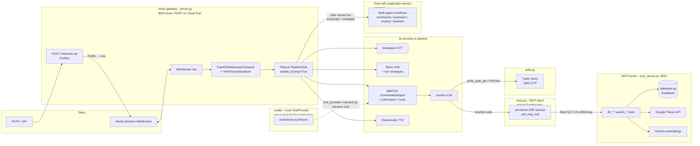

# Architecture — Enterprise Voice Hotel Concierge

This document explains how **telephony** (`server.py`), **Pipecat pipeline** (`pipeline.py`), **conversation reasoning** (`agent.py`), **voice-tier tools** (`tools.py`), and the **MCP data plane** (`mcp_server.py` + `database.py`) fit together; how **Twilio WebSockets** move audio; how **VAD** and **interruptions** work; how **Twilio Verify** gates sensitive reads and mutation routing; how **OpenTelemetry / Langfuse** and **PII scrubbing** behave; how **text-only evals** inject mock tools via `evals/`; and how **post-call LangGraph** workflows are triggered over HTTP after each session ends.

---

## 1. High-level system view



**Separation of concerns**

| Module | Responsibility |
|--------|----------------|
| `server.py` | Twilio HTTP + WebSocket I/O, TwiML, Media Streams **start** handshake, **`FastAPIWebsocketTransport`** (8 kHz, **transport VAD disabled**), **`PipelineRunner`**, root **OpenTelemetry** span per call, Langfuse exporter + **PII scrubbing**, Loguru patcher, greeting / disconnect frames, **post-call webhook** to LangGraph (`POST_CALL_WEBHOOK_URL`), **tracer `force_flush`** after the call. |
| `pipeline.py` | Pipeline graph, **Silero VAD** in the **LLM user aggregator**, constructs **`ConversationAgent(ani=...)`** (default real tools), wires **`agent.llm` / `agent.context`**, **`enable_tracing=True`**, metrics observers, idle / **EndFrame** safeguard; returns **`(PipelineTask, LLMContext)`** so `server.py` can export the live transcript. **Must not** import **`evals/`**. |
| `agent.py` | **Conversation reasoning core**: **`SYSTEM_PROMPT`**, Gemini via **`get_llm_service()`**, **`LLMContext`**, tool registration. Accepts injectable **`tool_provider: Callable[[str], list]`** (default **`tools.get_hotel_concierge_tools`**). Exposes **`run_turn(user_text)`** for text-only evals (no Twilio/STT/TTS). **Must not** import **`evals/`**. |
| `tools.py` | **Production ToolProvider** — Tier-1 Gemini tools: Twilio Verify–gated **`lookup_guest_reservation`**, MCP-backed reads (**`db_get_*`**, **`search_hotel_policies`**, **`search_nearby_places`**), **`route_to_reservation_specialist`** (secondary Gemini JSON decision + MCP **`db_modify_reservation`**), **`escalate_to_human`**. **Persistent MCP SSE/HTTP client** (`get_mcp_session` / `call_mcp_tool`)—not stdio. |
| `evals/` | **Eval-only ToolProvider** (`evals/tools.py` + `evals/fixtures.py`): same tool names/signatures, fixture data, **starts unauthenticated** (`auth_required` until mocked `verify_auth_pin`), **no** MCP/SMS/Twilio/`auth`/`tools.py` imports. Imported only by the eval harness / pytest, never by `agent` / `pipeline` / `server`. Golden dataset + DeepEval metrics live under this package. |
| `mcp_server.py` | **FastMCP** process: **SSE over HTTP** on **8001** (`mcp.run(transport="sse")`); owns **Supabase** and **Places** traffic; embeddings for RAG. |
| `database.py` | Supabase client and async-safe helpers (**`asyncio.to_thread`**); imported by **MCP only** for DB/RPC paths. |
| `auth.py` | **Twilio Verify** send/check; used from **`tools.py`** (not from MCP). |

Supporting: `services/*.py`, `prompts.py`.

### 1.1 Local development (two required processes + optional post-call)

There is **no** local Docker requirement for the voice stack. Developers run:

1. **`python mcp_server.py`** — FastMCP **SSE over HTTP** on **`127.0.0.1:8001`** (`mcp.run(transport="sse")`); loads **`database.py`**, Places, embeddings. This is **not** MCP stdio transport.
2. **`python server.py`** (or **`uvicorn server:app`**) — FastAPI + Pipecat, typically port **8000**.
3. **(Optional)** LangGraph post-call microservice — listens on **`POST_CALL_WEBHOOK_URL`** (default **`http://localhost:8002/webhook/process-call`**). If offline, the voice server logs a warning and continues shutdown.

**`tools.get_mcp_session()`** opens a **persistent** SSE connection to **`http://127.0.0.1:8001/sse`** and reuses it across tool calls (reconnects on failure). Voice and MCP must share loopback on the same host.

### 1.2 Google Cloud Run (multi-container)

Production deploy uses **Cloud Build** to build/push the image, then **`gcloud run services replace service.yaml`** (see **`README.md`**). The Knative **`Service`** in **`service.yaml`** defines **two containers** from the **same image**:

| Container | Command | Role |
|-----------|---------|------|
| **`voice-agent`** | Dockerfile default (**`uvicorn server:app`**) | Public HTTP + **`/ws`**; **`containerPort`** matches Cloud Run **`PORT`** (often **8080** in manifests). |
| **`mcp-server`** | **`python mcp_server.py`** | Internal **SSE** on **8001**; must start before the voice container serves traffic. |

**`run.googleapis.com/container-dependencies`** (e.g. `voice-agent` depends on `mcp-server`) plus a **TCP startup probe** on **8001** enforce startup order. Inside the instance, **`127.0.0.1:8001`** remains valid for **`tools.py`** without code changes.

If MCP is ever moved to a **separate** Cloud Run **Service**, update the SSE URL in **`tools.py`** and add appropriate networking/auth.

---

## 2. `server.py` — Telephony edge, transport, and observability

### 2.1 Inbound call → TwiML → WebSocket

1. **`POST /inbound-call`** reads Twilio form fields (`From`, `To`, `CallSid`).
2. TwiML **`Connect`** → **`Stream`** with `url=wss://{host}/ws`, `track="inbound_track"`, plus **custom parameters** `ani` / `dnis` for the Media Streams **start** payload.
3. Signaling stays on HTTP; media on WebSocket.

### 2.2 WebSocket bootstrap

- Waits for **`event == "start"`**; reads `streamSid`, `callSid`, `accountSid`, and **`customParameters`** for ANI/DNIS.
- **`TwilioFrameSerializer`**: full credentials → default Pipecat/Twilio REST behavior; otherwise **`auto_hang_up=False`** so the app still runs without auth token.

### 2.3 Transport audio and VAD split

- **8 kHz** in/out, **`add_wav_header=False`**, bidirectional audio.
- **`vad_enabled=False`** and **`vad_analyzer=None`** on the **transport**: turn-taking VAD lives in the **pipeline user aggregator** (Silero), not in the websocket transport layer.

### 2.4 Session lifecycle

- **`logger.contextualize(call_sid=..., ani=..., dnis=...)`** + **`loguru_pii_scrubber`**: redacts **ANI** and **+1XXXXXXXXXX** patterns in log messages while preserving **DNIS** where coded.
- **`on_client_connected`**: **`TTSSpeakFrame(GREETING_PROMPT)`**.
- **`on_client_disconnected`**: **`EndFrame()`**.
- **`task, call_context = build_pipeline(transport, call_sid=call_sid, ani=ani)`**: **`ani`** is passed into **`ConversationAgent`** (default real tool provider binds Verify + MCP to that caller); **`call_context`** is the live **`LLMContext`** used after the call for transcript export.

### 2.5 Tracing (Langfuse)

- **`configure_observability()`** (in **`server.py` only**): if **`LANGFUSE_PUBLIC_KEY`** / **`SECRET_KEY`** set, configures **`PIIScrubbingExporter`** → **`LANGFUSE_BASE_URL`/api/public/otel/v1/traces** + Basic auth; **`setup_tracing(service_name="hotel-concierge-v2", exporter=...)`**.
- **`tracer.start_as_current_span("twilio_voice_session", ...)`** with **`Context()`**, attributes **`session.id`**, **`call_sid`**, **`ani`**, **`dnis`** (span attributes scrubbed on export).
- **`PipelineTask(enable_tracing=True)`** in **`pipeline.py`** activates Pipecat span integration for the **live audio** pipeline.
- After **`runner.run(task)`**, **`tracer_provider.force_flush()`** so batches reach Langfuse before the worker tears down.

**Headless evals do not export traces.** `ConversationAgent.run_turn()` builds a separate `PipelineTask` without `enable_tracing`, and eval processes never import `server.py`, so OTLP/Langfuse setup never runs for golden replays.

### 2.6 Post-call LangGraph webhook

When **`runner.run(task)`** completes inside the **`twilio_voice_session`** span, **`server.py`**:

1. Reads messages from **`call_context`** (`get_messages()` or **`.messages`**).
2. Builds a plain-text transcript: **USER** / **BOT** lines, **BOT [ACTION]** tool calls, **SYSTEM [DATA]** tool results; skips system prompts and internal **`[SYSTEM EVENT]`** nudges.
3. **`POST`s** JSON to **`POST_CALL_WEBHOOK_URL`** (default **`http://localhost:8002/webhook/process-call`**) via **`httpx`**:

   ```json
   { "call_sid": "...", "guest_phone": "<ani>", "transcript": "..." }
   ```

The **LangGraph microservice** (not in this repo) runs stateful **multi-agent** workflows: guest profile enrichment, sentiment analysis, operational task routing, and automated outreach.

**Failure behavior:** **`httpx.ConnectError`** and **`httpx.TimeoutException`** log warnings; other exceptions log errors. The voice gateway always continues shutdown—post-call processing is best-effort and decoupled from the realtime path.

---

## 3. `pipeline.py` + `agent.py` — Graph, reasoning core, VAD, tracing flags

### 3.1 Frame order

```text
transport.input() → STT → user_aggregator → LLM → TTS → transport.output() → context_aggregator.assistant()
```

### 3.2 ConversationAgent and tool injection

- **`build_pipeline`** creates **`ConversationAgent(ani=ani)`**, which builds **`LLMContext`** (system prompt + tools) and registers tools on Gemini. Default **`tool_provider`** is **`tools.get_hotel_concierge_tools`** (real MCP + SMS).
- **`agent.llm`** and **`agent.context`** are wired into the same frame order as before; idle / VAD stay in **`pipeline.py`**.
- **Evals** construct **`ConversationAgent(ani=..., tool_provider=get_eval_hotel_concierge_tools)`** and call **`run_turn(user_text)`**. Production modules never import **`evals/`**; isolation is by import graph (eval tools structurally cannot reach MCP/SMS).
- Mock **`lookup_guest_reservation`** returns **`status: "auth_required"`** until **`verify_auth_pin`** (always succeeds in evals) flips the per-session closure flag—matching **`SYSTEM_PROMPT` Rule 4** and preserving tool-call order from historical calls. See **[`evals/EVAL_SPEC.md`](evals/EVAL_SPEC.md)**.

### 3.3 Silero VAD and turn strategies

- **`SileroVADAnalyzer`** + **`LLMUserAggregatorParams`**: **`VADUserTurnStartStrategy`**, **`SpeechTimeoutUserTurnStopStrategy`**, **`user_idle_timeout=5.0`**.

### 3.4 Interruptions vs Deepgram

- **`PipelineParams.allow_interruptions=True`**.
- **`DeepgramSTTService`**: **`should_interrupt=False`** (`services/stt.py`) so STT does not duplicate barge-in; Silero + aggregator own interruption semantics.
- **`interim_results=True`**, **`endpointing=False`** (endpointing deliberately off; coupling with aggregator/VAD).

### 3.5 Resilient Deepgram reconnect

**`ResilientDeepgramSTTService`** (`services/stt.py`) overrides **`_connection_handler`** to reset finalize flags after connection drops mid-finalize, avoiding a stuck pipeline that stops emitting transcripts.

### 3.6 Idle safeguard

Three **silence strikes** → spoken goodbye + **`EndFrame`**; earlier strikes **`LLMMessagesAppendFrame`** nudges. **`on_user_turn_started`** resets strikes.

### 3.7 Metrics

**`MetricsLogObserver`** + **`enable_metrics`** / **`enable_usage_metrics`** for latency and usage signals.

### 3.8 Return value for transcript export

**`build_pipeline`** returns **`(task, context)`** where **`context`** is the **`LLMContext`** instance wired into the aggregators. **`server.py`** keeps a reference for post-call transcript extraction; the pipeline module does not perform the webhook itself.

---

## 4. Twilio WebSocket audio

Twilio sends JSON Media Stream messages on **`/ws`**; **`TwilioFrameSerializer`** converts to/from Pipecat audio frames at **8 kHz**. **`transport`** hides Twilio framing from **`pipeline.py`**.

---

## 5. `auth.py` — Out-of-band verification

- **`send_verification_pin(phone_number)`** / **`check_verification_pin(phone_number, pin)`** use **Twilio Verify** (**`TWILIO_VERIFY_SERVICE_SID`**).
- SDK calls run in **`asyncio.to_thread`**.
- **`check_verification_pin`** strips non-digits from STT‑noisy PIN strings.

Integrated from **`tools.verify_auth_pin`** and **`lookup_guest_reservation`** (PIN required before MCP guest/reservation reads).

---

## 6. `tools.py` — Voice-tier tools and MCP over SSE/HTTP

Voice tools **do not** import **`database.py`**. The MCP boundary uses **SSE over HTTP**, **not** MCP stdio:

- **`get_mcp_session()`** — lazy-initializes a module-level **`ClientSession`** via **`sse_client("http://127.0.0.1:8001/sse")`** and **`AsyncExitStack`**; logs **"Persistent MCP session established"** on first connect.
- **`call_mcp_tool(tool_name, arguments)`** — reuses that session; on error, closes the stack and clears globals so the next call reconnects.

Deployment must expose MCP on that host/port (Cloud Run **sidecar** on loopback) or update the URL in **`get_mcp_session()`**.

Typical flows:

| Tool | Behavior |
|------|----------|
| **`verify_auth_pin`** | **`auth.check_verification_pin(ani, pin)`**; flips **`is_authenticated`**. |
| **`lookup_guest_reservation`** | If unauthenticated → **`auth.send_verification_pin(ani)`** and **`auth_required`** result; else MCP **`db_get_reservation`** or **`db_get_guest`** with **`ani`**. |
| **`route_to_reservation_specialist`** | Requires auth; loads context via MCP; **Gemini 2.5 Flash** with **`TIER_3_SPECIALIST_PROMPT`** and **`SpecialistDecision`** schema; **`action=="modify"`** → MCP **`db_modify_reservation`**. |
| **`search_hotel_policies`** / **`search_nearby_places`** | MCP **`search_*`**; results returned straight to Tier-1 LLM without a second synthesis LLM by default (see `prompts.py` / product copy). |
| **`escalate_to_human`** | Scripted success payload for agent speech (no ticketing integration in code unless extended). |

Structured mutation output (**`SpecialistDecision`**) constrains **`action`**, **`reservation_id`**, **`new_date`**, **`spoken_summary`** before an MCP write.

---

## 7. `mcp_server.py` — Data plane MCP host

- **FastMCP** **`Hotel-Data-Server`** binds **`0.0.0.0:8001`**; **`mcp.run(transport="sse")`** (not stdio).
- Registers **`db_get_guest`**, **`db_get_reservation`**, **`db_modify_reservation`**, **`search_hotel_policies`** (embedding + **`database.search_knowledge_base`**), **`search_nearby_places`** (Places API + hotel lat/lng bias).
- Imports **`database`** and loads **`SUPABASE_*`**, **`GEMINI_API_KEY`** (embeddings), and **`GOOGLE_MAPS_API_KEY`** from env.

On **Cloud Run**, this module runs as the **`mcp-server`** container (explicit **`command`**: **`python mcp_server.py`**) alongside **`voice-agent`** in **`service.yaml`**. Locally it is a separate terminal process.

---

## 8. `database.py` — Supabase

Single **`create_client`** at import (**must have `SUPABASE_URL` / `SUPABASE_KEY`** or import fails).

- **`get_guest_with_reservations`**, **`get_reservation_by_id`**, **`modify_reservation_date`**
- **`search_knowledge_base`** → **`match_hotel_policies`** RPC.

Blocking SDK work wrapped in **`asyncio.to_thread`**.

---

## 9. Design principles (updated)

1. **Voice gateway is transport + observability + post-call handoff** — realtime dialogue stays in Pipecat; durable enrichment runs in the external LangGraph service via webhook.
2. **Reasoning is separable from telephony** — **`agent.py`** owns Gemini + context + tools; **`pipeline.py`** owns audio ordering, VAD, idle; **`server.py`** owns Twilio. Text evals call **`run_turn`** without WebSockets/STT/TTS.
3. **Tools are injectable** — production default is MCP/SMS **`tools.py`**; evals inject **`evals/tools.py`**. Core code depends only on **`ToolProvider = Callable[[str], list]`**.
4. **Single pipeline definition** (`pipeline.py`) for ordering, VAD-based turns, interruptions policy, tracing flag, idle policy; exposes **`LLMContext`** for transcript export.
5. **Data tier behind MCP (SSE/HTTP)** — Supabase and Places only on the MCP host; **`tools.py`** holds a **persistent SSE client**, not stdio (replace URL for split deploys).
6. **Secrets and PII** — scrub logs and OTLP payloads where implemented; Verify before exposing reservation payloads to the LLM conversation.
7. **Telephony defaults** — 8 kHz, phone-oriented STT model, transport VAD off, aggregator VAD on.
8. **Post-call is best-effort** — webhook failures must not block voice shutdown or Twilio cleanup.
9. **Eval observability is intentionally off** — Langfuse OTel is Twilio-path only; golden replays must not spam production traces.

---

## 10. Related files

| Path | Role |
|------|------|
| `agent.py` | **`ConversationAgent`**, **`TurnResult`**, injectable **`tool_provider`**, headless **`run_turn`**. |
| `evals/` | Mock tools/fixtures, Langfuse extract/assemble, DeepEval metrics, golden pytest, **`EVAL_SPEC.md`**. |
| `evals/datasets/golden_v1.jsonl` | Curated golden conversations (assembled from `from_langfuse.jsonl` + `curation.json`). |
| `.github/workflows/eval-suite.yml` | PR CI for golden conversation pytest (`GEMINI_API_KEY` secret). |
| `services/stt.py` | **`ResilientDeepgramSTTService`**, telephony Deepgram settings. |
| `services/tts.py`, `services/llm.py` | ElevenLabs + Gemini factories. |
| `prompts.py` | System greeting, **`TIER_3_SPECIALIST_PROMPT`**, etc. |
| `models.py` | **`ModifyCheckoutRequest`** and other schemas (Tier-3 path uses **`SpecialistDecision`** in **`tools.py`** for structured mutation output). |
| `service.yaml` | Cloud Run **Service** manifest: multi-container spec, env, **`secretKeyRef`**, dependencies, probes (keep secrets out of plain `value:` in shared repos). |
| `README.md` | Local two-terminal workflow (+ optional LangGraph); **Dockerfile** for Cloud Build; evals + CI; MCP **SSE/HTTP** (not stdio). |

This layout keeps **PSTN signaling**, **streaming media**, **dialogue inference**, **auth**, **persistent data (MCP)**, **text evals (mock tools)**, and **post-call automation (LangGraph)** in separable tiers so each can change (e.g. remote MCP URL, alternate Verify, swap STT, different outreach workflows) without rewriting the full voice stack end-to-end.
