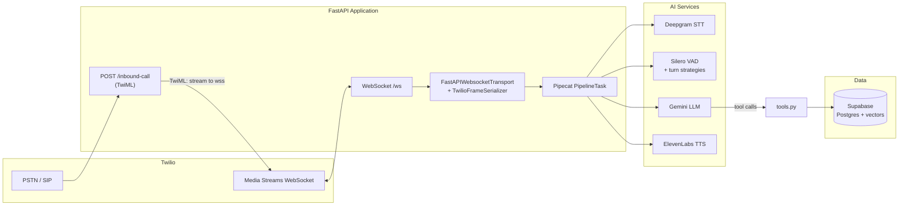

# Architecture — Enterprise Voice Hotel Concierge

This document describes how the **telephony edge** (`server.py`), **voice pipeline** (`pipeline.py`), and **agent tools** (`tools.py`) fit together, how **Twilio WebSockets** move audio, how **voice activity detection (VAD)** and **interruptions** behave, and how the **LLM** reaches **Supabase** only through validated tool code.

---

## 1. High-level system view



**Separation of concerns**

| Module | Responsibility |
|--------|----------------|
| `server.py` | HTTP + WebSocket **I/O**: Twilio request parsing, TwiML, Media Streams handshake, Pipecat **transport** wiring, **PipelineRunner** lifecycle, greeting/disconnect hooks. |
| `pipeline.py` | **Declarative pipeline**: STT/LLM/TTS factories, **Silero VAD**, **LLMContext** + tool schema, **user/assistant aggregators**, frame ordering, metrics, idle/disconnect policy. |
| `tools.py` | **Agent capabilities**: async functions the LLM may invoke; orchestration of **Supabase**, **Gemini embeddings**, and **Google Places**; Pydantic validation before writes. |

Supporting modules (`services/*.py`, `database.py`, `models.py`, `prompts.py`) keep credentials and schemas out of the orchestration layer.

---

## 2. `server.py` — Telephony edge and transport

### 2.1 Inbound call → TwiML → WebSocket URL

1. Twilio sends an HTTP **POST** to `/inbound-call` with standard voice form fields (`From`, `To`, `CallSid`, …).
2. The handler builds **TwiML**: a `<Connect><Stream>` whose `url` is `wss://{request host}/ws`, with `track="inbound_track"`.
3. **Custom parameters** (`ani`, `dnis`) are attached to the stream so the later WebSocket **start** event can recover caller/called numbers for logging and tool context.

This keeps **signaling** (HTTP) separate from **media** (WebSocket).

### 2.2 WebSocket session bootstrap

After the client upgrades to `/ws`:

1. The server **accepts** the socket and waits for Twilio Media Streams JSON.
2. It loops until an `event == "start"` message arrives. Identifiers such as `streamSid`, `callSid`, and optional `accountSid` are read from the **`start`** payload (not assumed to exist only at the JSON root).
3. **Custom parameters** from TwiML appear under `start.customParameters` and populate `ani` / `dnis`.
4. A **`TwilioFrameSerializer`** is constructed with `stream_sid`, and—when `TWILIO_AUTH_TOKEN` (and related IDs) are present—with credentials so Pipecat can use Twilio REST behavior (e.g. **auto hang-up**). If credentials are incomplete, the serializer uses **`auto_hang_up=False`** so the app still runs without failing closed.

### 2.3 `FastAPIWebsocketTransport` — audio framing

The transport is configured for **telephony**:

- **8 kHz** input and output sample rates (Twilio μ-law stream expectations).
- **No WAV header** on raw payloads (`add_wav_header=False`).
- **Bidirectional** audio: `audio_in_enabled` and `audio_out_enabled`.

The serializer turns Twilio’s wire format into Pipecat **frames** for upstream processors and encodes outbound audio back to Twilio.

### 2.4 Session lifecycle and observability

- **`logger.contextualize(call_sid=..., ani=..., dnis=...)`** scopes structured logs to one call.
- **`on_client_connected`**: queues a **`TTSSpeakFrame`** with the greeting so the agent speaks immediately when media is live.
- **`on_client_disconnected`**: queues **`EndFrame()`** to tear down the pipeline cleanly.
- **`PipelineRunner.run(task)`** blocks until the pipeline completes—one runner **per call** on that WebSocket.

---

## 3. `pipeline.py` — Pipeline graph and turn-taking

### 3.1 Pipeline topology (the “audio highway”)

Frames flow **in order**:

```text
transport.input()  →  STT  →  user_aggregator  →  LLM  →  TTS  →  transport.output()  →  context_aggregator.assistant()
```

- **Input path**: raw audio → **Deepgram** text.
- **User aggregator**: uses **VAD** and **turn strategies** to decide when the user’s speech constitutes a “turn,” updates **`LLMContext`** with user text.
- **LLM**: Gemini generates assistant content and may emit **tool calls**.
- **TTS**: text → audio for Twilio.
- **Assistant aggregator**: commits assistant messages to context **after** output.

This ordering ensures the **context** matches what was heard and spoken in session order.

### 3.2 Services and tools registration

- **STT / TTS / LLM** are constructed via `services/stt.py`, `services/tts.py`, `services/llm.py` (environment-driven API keys and models).
- **`LLMContext`** is initialized with the **system prompt** and a **`ToolsSchema`** built from `tools.hotel_concierge_tools`.
- Each Python tool function is registered on the LLM service with **`register_direct_function`**, binding Gemini **function calling** to **in-process** async handlers (no ad-hoc HTTP bridge inside the pipeline).

### 3.3 Silero VAD and turn strategies

**`SileroVADAnalyzer`** (`VADParams`) sets thresholds tuned for **noisy phone environments** (e.g. confidence, minimum volume, start/stop windows). That analyzer is passed into **`LLMUserAggregatorParams`** as `vad_analyzer`.

**Turn-taking** uses **`UserTurnStrategies`**:

- **Start**: **`VADUserTurnStartStrategy`** — a new user turn begins when VAD indicates speech consistent with the configured sensitivity.
- **Stop**: **`SpeechTimeoutUserTurnStopStrategy`** — end of utterance is inferred from speech timing, complementary to STT endpointing.

Together, VAD + strategies define **when** user audio is treated as a completed conversational turn for the LLM, as opposed to arbitrary partial transcripts.

### 3.4 Interruptions vs. Deepgram endpointing

The **`PipelineTask`** sets **`allow_interruptions=True`**, which lets Pipecat **interrupt** assistant playback when the user speaks again mid-utterance—appropriate for live phone conversations.

The **Deepgram** service is configured with **`should_interrupt=False`**. The intent (per code comments) is to avoid **double-handling**: **Silero VAD** and the **LLM user aggregator** own interruption semantics, while Deepgram still provides **streaming transcripts** with **`interim_results=True`** and telephony-oriented **`endpointing`** in `services/stt.py`.

So: **interruption** is primarily a **pipeline / VAD / task** concern; **STT** focuses on **accurate, low-latency text** with explicit endpointing knobs.

### 3.5 Idle handling (operational safeguard)

The **user** aggregator registers **`on_user_turn_idle`**: if the caller is silent for **`user_idle_timeout`** (5 seconds), a **strike** counter increments. After three strikes, the pipeline pushes a spoken **goodbye** `TTSSpeakFrame` and **`EndFrame()`** to limit **Twilio** usage. Earlier strikes inject a synthetic **user** message via **`LLMMessagesAppendFrame`** so the model nudges the caller politely.

**`on_user_turn_started`** resets the strike counter when speech resumes.

### 3.6 Observability

- **`MetricsLogObserver`** and **`PipelineParams(enable_metrics=True, enable_usage_metrics=True)`** expose latency and token-related metrics for tuning and cost awareness.

---

## 4. Twilio WebSocket audio streaming (end-to-end)

Conceptually:

1. **Caller audio** arrives as Twilio Media Streams messages on `/ws`.
2. **`TwilioFrameSerializer`** converts stream messages into **audio frames** for Pipecat.
3. **`transport.input()`** feeds **STT**, which emits **transcription frames** toward the user aggregator.
4. **Assistant audio** is produced by **TTS** and written through **`transport.output()`**, which serializes back to Twilio’s expected **8 kHz** stream.

The **same WebSocket** carries both directions; Pipecat’s transport abstracts the **framing** so `pipeline.py` stays agnostic of Twilio’s JSON message shapes.

---

## 5. `tools.py` — LLM interaction with Supabase

The **LLM never holds raw SQL** or direct DB handles. All database access goes through **`database.py`**, invoked only from **tool functions** that Gemini selects via **function calling**.

### 5.1 Tool surface

Exported **`hotel_concierge_tools`** includes, among others:

- **Guest and reservations** — `lookup_guest_reservation`, `modify_reservation_date`: read/update **relational** tables via Supabase client calls.
- **Policy RAG** — `search_hotel_policies`: embed the question with **Gemini embeddings**, then call a Supabase **RPC** (`match_hotel_policies`) for vector similarity search.
- **Escalation** — `escalate_to_human`: workflow signal (implementation returns a structured success message to the model).
- **Places** — `search_nearby_places`: **Google Places** HTTP API (not Supabase), with field masks and location bias.

### 5.2 Database layer (`database.py`)

- A single **Supabase client** is created from **`SUPABASE_URL`** and **`SUPABASE_KEY`** at import time.
- Blocking SDK methods run inside **`asyncio.to_thread`** so the **async** event loop is not blocked during I/O.
- **Relational** helpers query tables such as **`guests`** and **`reservations`**.
- **Vector** search uses **`supabase.rpc('match_hotel_policies', { ... })`** with **`query_embedding`**, **`match_threshold`**, and **`match_count`**.

### 5.3 Validation before writes

For **`modify_reservation_date`**, raw LLM arguments are validated with **`ModifyCheckoutRequest`** (`models.py`) so **invalid dates** or malformed IDs are rejected **before** `database.modify_reservation_date` runs—defense in depth against ambiguous natural-language dates.

### 5.4 Dynamic behavior

“Dynamic” here means **model-driven**, not **ad-hoc**:

1. The model chooses a **tool** and **arguments** from the conversation.
2. Pipecat invokes the corresponding **Python** coroutine with **`FunctionCallParams`**.
3. The tool reads/writes **Supabase** or calls **external APIs**, then returns a **JSON-serializable** result to the model.
4. The model incorporates results into the next **spoken** reply (subject to the **system prompt** in `prompts.py`).

---

## 6. Design principles (summary)

1. **Transport-only server** — `server.py` should not embed business rules; it connects Twilio to Pipecat.
2. **Single pipeline definition** — `pipeline.py` is the source of truth for frame order, VAD, interruptions, and metrics.
3. **Tools as the only DB and side-effect boundary** — `tools.py` + `database.py` isolate **Supabase** and external keys from the rest of the stack.
4. **Telephony-first defaults** — 8 kHz paths, phone STT model default, short LLM **`max_tokens`**, brief system prompt rules in `prompts.py`.

---

## 7. Related files

| File | Role |
|------|------|
| `services/stt.py`, `services/tts.py`, `services/llm.py` | Vendor-specific service construction. |
| `database.py` | Supabase client and data access helpers. |
| `models.py` | Pydantic schemas for tool inputs touching the DB. |
| `prompts.py` | System and greeting strings driving concierge behavior. |

This architecture keeps **signaling**, **streaming media**, **dialogue state**, and **data access** in separate layers so each can evolve independently (e.g. swapping STT or changing schema) without rewriting the entire voice stack.
